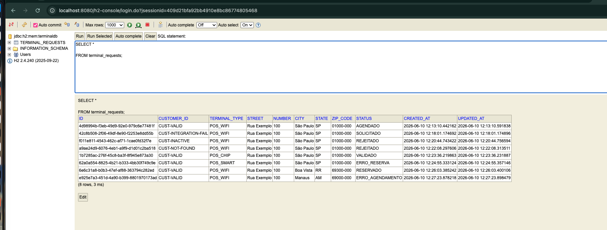
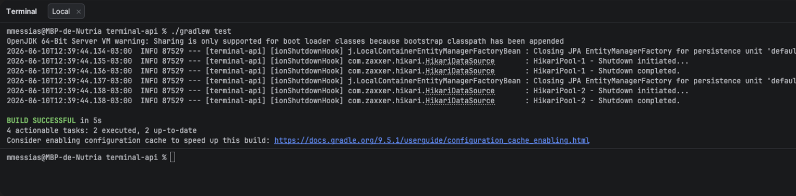

# Terminal Request API

API para o case técnico de **Reserva de Terminal POS**.

A aplicação recebe uma solicitação de terminal POS, cria o registro com status `SOLICITADO` e processa o fluxo de forma assíncrona por evento interno.

```text
SOLICITADO -> VALIDADO -> RESERVADO -> AGENDADO
```

Estados de falha de negócio:

```text
REJEITADO
ERRO_RESERVA
ERRO_AGENDAMENTO
```

Também foram simuladas falhas técnicas de integração. Nesses casos, o status permanece no último estado persistido.

---

## Tecnologias

- Java 25
- Spring Boot
- Spring Web
- Spring Data JPA
- H2 Database
- Lombok
- Postman Collection

---

## Arquitetura

A solução está organizada em camadas:

```text
presentation
application
domain
infrastructure
```

O processamento da solicitação é realizado por um workflow com steps encadeados:

```text
ValidateCustomerStep
        ↓
ReserveTerminalStep
        ↓
ScheduleDeliveryStep
```

Cada etapa executa sua regra de negócio, altera o status da solicitação quando necessário e o workflow persiste o estado antes de avançar.

---

## Retomada e reprocessamento do workflow

O workflow identifica dinamicamente qual etapa deve ser executada com base no status atual da solicitação.

Isso permite que solicitações sejam retomadas a partir do último estado persistido, evitando a reexecução de etapas já concluídas.

### Mapeamento dos steps

| Status atual | Step executado |
|---|---|
| `SOLICITADO` | `ValidateCustomerStep` |
| `VALIDADO` | `ReserveTerminalStep` |
| `RESERVADO` | `ScheduleDeliveryStep` |
| `AGENDADO` | Nenhum |
| `REJEITADO` | Nenhum |
| `ERRO_RESERVA` | Nenhum |
| `ERRO_AGENDAMENTO` | Nenhum |

### Regras de execução

- Apenas o step compatível com o status atual será executado.
- Steps já concluídos são ignorados.
- Após a execução de um step, a solicitação é persistida.
- O próximo step será executado somente quando o resultado for `CONTINUE`.
- Caso o resultado seja `STOP`, o workflow é encerrado.
- Caso nenhum step suporte o status atual, nenhuma ação será executada.

---

## Processamento Assíncrono

Ao chamar o endpoint de criação:

```http
POST /terminal-requests
```

a aplicação:

1. Cria a solicitação com status `SOLICITADO`.
2. Persiste a solicitação.
3. Publica um evento interno.
4. Um listener processa o fluxo de forma assíncrona.
5. O status final deve ser consultado via `GET`.

Por isso, o `POST` retorna sempre o estado inicial:

```text
SOLICITADO
```

---

## Como executar a aplicação

Na raiz do projeto:

```bash
./gradlew clean bootRun
```

A aplicação ficará disponível em:

```text
http://localhost:8080
```

---

## H2 Database

Console do H2:

```text
http://localhost:8080/h2-console
```

Configuração:

```text
JDBC URL: jdbc:h2:mem:terminaldb
User: sa
Password: deixe vazio
```

Consulta útil:

```sql
SELECT * FROM terminal_requests;
```

---

## Como executar os testes automatizados

```bash
./gradlew test
```

---

## Collection Postman

O projeto disponibiliza uma collection do Postman na raiz do repositório:

```text
Terminal Request Case.postman_collection.json
```

A collection possui os cenários de teste do case técnico.

A collection também demonstra os comportamentos de retomada do workflow baseados no status persistido da solicitação, permitindo validar cenários de reprocessamento após falhas técnicas simuladas.

Variáveis utilizadas:

```text
baseUrl = http://localhost:8080
terminalRequestId = vazio inicialmente
```

Fluxo recomendado para validar cada cenário:

1. Execute um dos cenários `POST`.
2. Copie o campo `id` retornado.
3. Preencha a variável `terminalRequestId`.
4. Execute `09 - Consultar Solicitação`.
5. Valide o status final esperado.

---

## Endpoints

### Criar solicitação

```http
POST /terminal-requests
```

#### Request

```json
{
  "customerId": "CUST-VALID",
  "terminalType": "POS_WIFI",
  "address": {
    "street": "Rua Exemplo",
    "number": "100",
    "city": "São Paulo",
    "state": "SP",
    "zipCode": "01000-000"
  }
}
```

#### Response

```http
201 Created
```

```json
{
  "id": "f479d1d5-a88c-4190-8de7-80a197b4df90",
  "customerId": "CUST-VALID",
  "terminalType": "POS_WIFI",
  "status": "SOLICITADO",
  "createdAt": "2026-06-09T16:59:47.947104"
}
```

---

### Consultar solicitação

```http
GET /terminal-requests/{id}
```

#### Response para ID existente

```http
200 OK
```

```json
{
  "id": "c690ba6a-f10a-43d0-89a0-e34d21e99d39",
  "customerId": "CUST-VALID",
  "terminalType": "POS_WIFI",
  "status": "AGENDADO",
  "createdAt": "2026-06-09T17:22:23.164666"
}
```

#### Response para ID inexistente

```http
404 Not Found
```

```json
{
  "code": "TERMINAL_REQUEST_NOT_FOUND",
  "message": "Terminal request not found: 9552d10a-e05a-4fa6-996d-8de7baf84bfa",
  "timestamp": "2026-06-09T17:25:55.304014"
}
```

---

## Validações de payload e parâmetros

O endpoint de criação valida os campos obrigatórios antes de criar a solicitação.

### Campos obrigatórios

| Campo | Regra | Exemplo inválido |
|---|---|---|
| `customerId` | Obrigatório e não pode ser vazio | `""` |
| `terminalType` | Obrigatório e não pode ser vazio | `""` |
| `address` | Obrigatório | `null` |
| `address.street` | Obrigatório e não pode ser vazio | `""` |
| `address.number` | Obrigatório e não pode ser vazio | `""` |
| `address.city` | Obrigatório e não pode ser vazio | `""` |
| `address.state` | Obrigatório e não pode ser vazio | `""` |
| `address.zipCode` | Obrigatório e não pode ser vazio | `""` |

### Tipos de terminal aceitos

```text
POS_WIFI
POS_CHIP
POS_SMART
```

Quando `terminalType` recebe um valor fora da enumeração, a API retorna `400 Bad Request`.

### Response para payload inválido

```http
400 Bad Request
```

```json
{
  "code": "INVALID_REQUEST",
  "message": "customerId is required",
  "timestamp": "2026-06-10T10:20:00.000000"
}
```

### Response para `terminalType` inválido

```http
400 Bad Request
```

```json
{
  "code": "INVALID_REQUEST",
  "message": "No enum constant com.rede.terminal_api.domain.model.TerminalType.POS_INVALID",
  "timestamp": "2026-06-10T10:20:00.000000"
}
```

### Response para ID inválido na consulta

```http
400 Bad Request
```

```json
{
  "code": "INVALID_REQUEST",
  "message": "Invalid request parameter: id",
  "timestamp": "2026-06-10T10:20:00.000000"
}
```


---

## Regras simuladas nas integrações HTTP

### Customer Service

| customerId | Resultado |
|---|---|
| `CUST-VALID` | Cliente encontrado e ativo |
| `CUST-INACTIVE` | Cliente encontrado, porém inativo |
| `CUST-NOT-FOUND` | Cliente inexistente |
| `CUST-INTEGRATION-FAIL` | Falha técnica na integração |

### Terminal Reservation Service

| terminalType | Resultado |
|---|---|
| `POS_WIFI` | Terminal disponível |
| `POS_SMART` | Terminal indisponível |
| `POS_CHIP` | Falha técnica na integração |

### Logistics Service

| state | Resultado |
|---|---|
| `AM` | Falha de negócio no agendamento |
| `RR` | Falha técnica na integração |
| Qualquer outro estado | Agendamento realizado com sucesso |

---

## Cenários da collection

A collection também evidencia o comportamento do workflow orientado a estado.

Quando uma solicitação é reprocessada, apenas o step compatível com o status atual será executado, evitando a reexecução de etapas já concluídas.

Exemplos:

```text
SOLICITADO -> inicia em ValidateCustomerStep
VALIDADO   -> inicia em ReserveTerminalStep
RESERVADO  -> inicia em ScheduleDeliveryStep

AGENDADO
REJEITADO
ERRO_RESERVA
ERRO_AGENDAMENTO
        -> nenhum step é executado
```

| Request | Resultado final esperado | Descrição |
|---|---:|---|
| `01 - AGENDADO` | `AGENDADO` | Cliente válido, terminal disponível e logística disponível. |
| `02 - SOLICITADO - (Cliente Falha na Integração com Serviço)` | `SOLICITADO` | Falha técnica na validação do cliente. O workflow poderá ser retomado a partir de `SOLICITADO`. |
| `03 - REJEITADO (Cliente Inativo)` | `REJEITADO` | Cliente encontrado, porém inativo. |
| `04 - REJEITADO (Cliente Não Encontrado)` | `REJEITADO` | Cliente inexistente. |
| `05 - VALIDADO - (Reserva Falha na Integração com Serviço)` | `VALIDADO` | Falha técnica na reserva. O workflow poderá ser retomado a partir de `VALIDADO`. |
| `06 - ERRO_RESERVA (Reserva Não Encontrada)` | `ERRO_RESERVA` | Cliente válido, mas não há terminal disponível. |
| `07 - RESERVADO - (Agendamento Falha na Integração com Serviço)` | `RESERVADO` | Falha técnica no agendamento. O workflow poderá ser retomado a partir de `RESERVADO`. |
| `08- ERRO_AGENDAMENTO` | `ERRO_AGENDAMENTO` | Cliente validado e terminal reservado, mas a logística retorna falha de negócio. |
| `09 - Consultar Solicitação` | `200 OK` | Consulta uma solicitação existente usando `terminalRequestId`. |
| `10 - Solicitação Não Encontrada` | `404 Not Found` | Consulta uma solicitação inexistente. |
| `11 - Validação - Payload Inválido` | `400 Bad Request` | Envia campos obrigatórios vazios. |
| `12 - Validação - TerminalType Inválido` | `400 Bad Request` | Envia um tipo de terminal fora da enumeração. |
| `13 - Validação - TerminalType Em Branco` | `400 Bad Request` | Envia `terminalType` vazio. |
| `14 - Validação - Address Nulo` | `400 Bad Request` | Envia `address` como `null`. |
| `15 - Validação - ID Inválido` | `400 Bad Request` | Consulta usando um ID que não é UUID válido. |

---

## Exemplos com cURL

### 01 - AGENDADO

Cliente válido, terminal disponível e logística disponível.

```bash
curl -X POST http://localhost:8080/terminal-requests \
  -H "Content-Type: application/json" \
  -d '{
    "customerId": "CUST-VALID",
    "terminalType": "POS_WIFI",
    "address": {
      "street": "Rua Exemplo",
      "number": "100",
      "city": "São Paulo",
      "state": "SP",
      "zipCode": "01000-000"
    }
  }'
```

Resposta inicial esperada:

```http
201 Created
```

```json
{
  "id": "4d98994b-f3eb-49d9-92e0-979c6e77481f",
  "customerId": "CUST-VALID",
  "terminalType": "POS_WIFI",
  "status": "SOLICITADO",
  "createdAt": "2026-06-10T12:13:10.442162"
}
```

Após consultar por ID:

```bash
curl -X GET http://localhost:8080/terminal-requests/4d98994b-f3eb-49d9-92e0-979c6e77481f
```

Resposta final esperada:

```http
200 OK
```

```json
{
  "id": "4d98994b-f3eb-49d9-92e0-979c6e77481f",
  "customerId": "CUST-VALID",
  "terminalType": "POS_WIFI",
  "status": "AGENDADO",
  "createdAt": "2026-06-10T12:13:10.442162"
}
```

---

### 02 - SOLICITADO - Cliente Falha na Integração com Serviço

Falha técnica ao consultar o serviço de clientes. A solicitação permanece no último estado persistido: `SOLICITADO`.

```bash
curl -X POST http://localhost:8080/terminal-requests \
  -H "Content-Type: application/json" \
  -d '{
    "customerId": "CUST-INTEGRATION-FAIL",
    "terminalType": "POS_WIFI",
    "address": {
      "street": "Rua Exemplo",
      "number": "100",
      "city": "São Paulo",
      "state": "SP",
      "zipCode": "01000-000"
    }
  }'
```

Resposta inicial esperada:

```http
201 Created
```

```json
{
  "id": "42c8b508-2f06-49df-8e90-f2253e8dd55b",
  "customerId": "CUST-INTEGRATION-FAIL",
  "terminalType": "POS_WIFI",
  "status": "SOLICITADO",
  "createdAt": "2026-06-10T12:18:01.174692"
}
```

Após consultar por ID:

```bash
curl -X GET http://localhost:8080/terminal-requests/42c8b508-2f06-49df-8e90-f2253e8dd55b
```

Resposta final esperada:

```http
200 OK
```

```json
{
  "id": "42c8b508-2f06-49df-8e90-f2253e8dd55b",
  "customerId": "CUST-INTEGRATION-FAIL",
  "terminalType": "POS_WIFI",
  "status": "SOLICITADO",
  "createdAt": "2026-06-10T12:18:01.174692"
}
```

---

### 03 - REJEITADO - Cliente Inativo

Cliente encontrado, porém inativo.

```bash
curl -X POST http://localhost:8080/terminal-requests \
  -H "Content-Type: application/json" \
  -d '{
    "customerId": "CUST-INACTIVE",
    "terminalType": "POS_WIFI",
    "address": {
      "street": "Rua Exemplo",
      "number": "100",
      "city": "São Paulo",
      "state": "SP",
      "zipCode": "01000-000"
    }
  }'
```

Resposta inicial esperada:

```http
201 Created
```

```json
{
  "id": "f011e811-4543-462c-af71-1cae0fd32f7e",
  "customerId": "CUST-INACTIVE",
  "terminalType": "POS_WIFI",
  "status": "SOLICITADO",
  "createdAt": "2026-06-10T12:20:44.743422"
}
```

Após consultar por ID:

```bash
curl -X GET http://localhost:8080/terminal-requests/f011e811-4543-462c-af71-1cae0fd32f7e
```

Resposta final esperada:

```http
200 OK
```

```json
{
  "id": "f011e811-4543-462c-af71-1cae0fd32f7e",
  "customerId": "CUST-INACTIVE",
  "terminalType": "POS_WIFI",
  "status": "REJEITADO",
  "createdAt": "2026-06-10T12:20:44.743422"
}
```

---

### 04 - REJEITADO - Cliente Não Encontrado

Cliente inexistente no serviço externo simulado.

```bash
curl -X POST http://localhost:8080/terminal-requests \
  -H "Content-Type: application/json" \
  -d '{
    "customerId": "CUST-NOT-FOUND",
    "terminalType": "POS_WIFI",
    "address": {
      "street": "Rua Exemplo",
      "number": "100",
      "city": "São Paulo",
      "state": "SP",
      "zipCode": "01000-000"
    }
  }'
```

Resposta inicial esperada:

```http
201 Created
```

```json
{
  "id": "a9ae24d9-6076-4eb1-a9f9-d1d01c2ba518",
  "customerId": "CUST-NOT-FOUND",
  "terminalType": "POS_WIFI",
  "status": "SOLICITADO",
  "createdAt": "2026-06-10T12:22:08.297606"
}
```

Após consultar por ID:

```bash
curl -X GET http://localhost:8080/terminal-requests/a9ae24d9-6076-4eb1-a9f9-d1d01c2ba518
```

Resposta final esperada:

```http
200 OK
```

```json
{
  "id": "a9ae24d9-6076-4eb1-a9f9-d1d01c2ba518",
  "customerId": "CUST-NOT-FOUND",
  "terminalType": "POS_WIFI",
  "status": "REJEITADO",
  "createdAt": "2026-06-10T12:22:08.297606"
}
```

---

### 05 - VALIDADO - Reserva Falha na Integração com Serviço

Cliente validado, mas ocorre falha técnica na integração de reserva. A solicitação permanece no último estado persistido: `VALIDADO`.

```bash
curl -X POST http://localhost:8080/terminal-requests \
  -H "Content-Type: application/json" \
  -d '{
    "customerId": "CUST-VALID",
    "terminalType": "POS_CHIP",
    "address": {
      "street": "Rua Exemplo",
      "number": "100",
      "city": "São Paulo",
      "state": "SP",
      "zipCode": "01000-000"
    }
  }'
```

Resposta inicial esperada:

```http
201 Created
```

```json
{
  "id": "1b7285ac-276f-45c8-ba3f-8f945e873a30",
  "customerId": "CUST-VALID",
  "terminalType": "POS_CHIP",
  "status": "SOLICITADO",
  "createdAt": "2026-06-10T12:23:36.219863"
}
```

Após consultar por ID:

```bash
curl -X GET http://localhost:8080/terminal-requests/1b7285ac-276f-45c8-ba3f-8f945e873a30
```

Resposta final esperada:

```http
200 OK
```

```json
{
  "id": "1b7285ac-276f-45c8-ba3f-8f945e873a30",
  "customerId": "CUST-VALID",
  "terminalType": "POS_CHIP",
  "status": "VALIDADO",
  "createdAt": "2026-06-10T12:23:36.219863"
}
```

---

### 06 - ERRO_RESERVA - Reserva Não Encontrada

Cliente válido, mas não há terminal disponível para o tipo solicitado.

```bash
curl -X POST http://localhost:8080/terminal-requests \
  -H "Content-Type: application/json" \
  -d '{
    "customerId": "CUST-VALID",
    "terminalType": "POS_SMART",
    "address": {
      "street": "Rua Exemplo",
      "number": "100",
      "city": "São Paulo",
      "state": "SP",
      "zipCode": "01000-000"
    }
  }'
```

Resposta inicial esperada:

```http
201 Created
```

```json
{
  "id": "62a0a554-8825-4b21-b333-4bb30f749c9e",
  "customerId": "CUST-VALID",
  "terminalType": "POS_SMART",
  "status": "SOLICITADO",
  "createdAt": "2026-06-10T12:24:55.333124"
}
```

Após consultar por ID:

```bash
curl -X GET http://localhost:8080/terminal-requests/62a0a554-8825-4b21-b333-4bb30f749c9e
```

Resposta final esperada:

```http
200 OK
```

```json
{
  "id": "62a0a554-8825-4b21-b333-4bb30f749c9e",
  "customerId": "CUST-VALID",
  "terminalType": "POS_SMART",
  "status": "ERRO_RESERVA",
  "createdAt": "2026-06-10T12:24:55.333124"
}
```

---

### 07 - RESERVADO - Agendamento Falha na Integração com Serviço

Cliente validado e terminal reservado, mas ocorre falha técnica na logística. A solicitação permanece no último estado persistido: `RESERVADO`.

```bash
curl -X POST http://localhost:8080/terminal-requests \
  -H "Content-Type: application/json" \
  -d '{
    "customerId": "CUST-VALID",
    "terminalType": "POS_WIFI",
    "address": {
      "street": "Rua Exemplo",
      "number": "100",
      "city": "Boa Vista",
      "state": "RR",
      "zipCode": "69300-000"
    }
  }'
```

Resposta inicial esperada:

```http
201 Created
```

```json
{
  "id": "6e6c31a8-b0b3-47ef-af88-363794c282ed",
  "customerId": "CUST-VALID",
  "terminalType": "POS_WIFI",
  "status": "SOLICITADO",
  "createdAt": "2026-06-10T12:26:03.385242"
}
```

Após consultar por ID:

```bash
curl -X GET http://localhost:8080/terminal-requests/6e6c31a8-b0b3-47ef-af88-363794c282ed
```

Resposta final esperada:

```http
200 OK
```

```json
{
  "id": "6e6c31a8-b0b3-47ef-af88-363794c282ed",
  "customerId": "CUST-VALID",
  "terminalType": "POS_WIFI",
  "status": "RESERVADO",
  "createdAt": "2026-06-10T12:26:03.385242"
}
```

---

### 08 - ERRO_AGENDAMENTO

Cliente validado e terminal reservado, mas a logística retorna falha de negócio para o agendamento.

```bash
curl -X POST http://localhost:8080/terminal-requests \
  -H "Content-Type: application/json" \
  -d '{
    "customerId": "CUST-VALID",
    "terminalType": "POS_WIFI",
    "address": {
      "street": "Rua Exemplo",
      "number": "100",
      "city": "Manaus",
      "state": "AM",
      "zipCode": "69000-000"
    }
  }'
```

Resposta inicial esperada:

```http
201 Created
```

```json
{
  "id": "e925e7a3-451d-4a90-b399-8801970173ad",
  "customerId": "CUST-VALID",
  "terminalType": "POS_WIFI",
  "status": "SOLICITADO",
  "createdAt": "2026-06-10T12:27:23.878218"
}
```

Após consultar por ID:

```bash
curl -X GET http://localhost:8080/terminal-requests/e925e7a3-451d-4a90-b399-8801970173ad
```

Resposta final esperada:

```http
200 OK
```

```json
{
  "id": "e925e7a3-451d-4a90-b399-8801970173ad",
  "customerId": "CUST-VALID",
  "terminalType": "POS_WIFI",
  "status": "ERRO_AGENDAMENTO",
  "createdAt": "2026-06-10T12:27:23.878218"
}
```

---

### 09 - Consultar Solicitação

Use o ID retornado no cenário `01 - AGENDADO`.

```bash
curl -X GET http://localhost:8080/terminal-requests/4d98994b-f3eb-49d9-92e0-979c6e77481f
```

Resposta esperada:

```http
200 OK
```

```json
{
  "id": "4d98994b-f3eb-49d9-92e0-979c6e77481f",
  "customerId": "CUST-VALID",
  "terminalType": "POS_WIFI",
  "status": "AGENDADO",
  "createdAt": "2026-06-10T12:13:10.442162"
}
```

---

### 10 - Solicitação Não Encontrada

```bash
curl -X GET http://localhost:8080/terminal-requests/9552d10a-e05a-4fa6-996d-8de7baf84bfa
```

Resposta esperada:

```http
404 Not Found
```

```json
{
  "code": "TERMINAL_REQUEST_NOT_FOUND",
  "message": "Terminal request not found: 9552d10a-e05a-4fa6-996d-8de7baf84bfa",
  "timestamp": "2026-06-10T12:29:26.237262"
}
```

---

### 11 - Validação - Payload Inválido

Campos obrigatórios vazios devem retornar `400 Bad Request`.

```bash
curl -X POST http://localhost:8080/terminal-requests \
  -H "Content-Type: application/json" \
  -d '{
    "customerId": "",
    "terminalType": "POS_WIFI",
    "address": {
      "street": "",
      "number": "100",
      "city": "São Paulo",
      "state": "SP",
      "zipCode": "01000-000"
    }
  }'
```

Resposta esperada:

```http
400 Bad Request
```

```json
{
  "code": "INVALID_REQUEST",
  "message": "customerId is required",
  "timestamp": "2026-06-10T12:30:07.060197"
}
```

---

### 12 - Validação - TerminalType Inválido

O campo `terminalType` deve ser um dos valores aceitos pela API.

```bash
curl -X POST http://localhost:8080/terminal-requests \
  -H "Content-Type: application/json" \
  -d '{
    "customerId": "CUST-VALID",
    "terminalType": "POS_INVALID",
    "address": {
      "street": "Rua Exemplo",
      "number": "100",
      "city": "São Paulo",
      "state": "SP",
      "zipCode": "01000-000"
    }
  }'
```

Resposta esperada:

```http
400 Bad Request
```

```json
{
  "code": "INVALID_REQUEST",
  "message": "No enum constant com.rede.terminal_api.domain.model.TerminalType.POS_INVALID",
  "timestamp": "2026-06-10T12:30:46.900203"
}
```

---

### 13 - Validação - TerminalType Em Branco

```bash
curl -X POST http://localhost:8080/terminal-requests \
  -H "Content-Type: application/json" \
  -d '{
    "customerId": "CUST-VALID",
    "terminalType": "",
    "address": {
      "street": "Rua Exemplo",
      "number": "100",
      "city": "São Paulo",
      "state": "SP",
      "zipCode": "01000-000"
    }
  }'
```

Resposta esperada:

```http
400 Bad Request
```

```json
{
  "code": "INVALID_REQUEST",
  "message": "terminalType is required",
  "timestamp": "2026-06-10T12:31:23.638706"
}
```

---

### 14 - Validação - Address Nulo

```bash
curl -X POST http://localhost:8080/terminal-requests \
  -H "Content-Type: application/json" \
  -d '{
    "customerId": "CUST-VALID",
    "terminalType": "POS_WIFI",
    "address": null
  }'
```

Resposta esperada:

```http
400 Bad Request
```

```json
{
  "code": "INVALID_REQUEST",
  "message": "address is required",
  "timestamp": "2026-06-10T12:31:53.070927"
}
```

---

### 15 - Validação - ID Inválido

```bash
curl -X GET http://localhost:8080/terminal-requests/invalid-id
```

Resposta esperada:

```http
400 Bad Request
```

```json
{
  "code": "INVALID_REQUEST",
  "message": "Invalid request parameter: id",
  "timestamp": "2026-06-10T12:32:23.140152"
}
```


## Evidências de Persistência (H2)

Após a execução dos cenários da collection do Postman, foi realizada consulta diretamente no console H2 utilizando:

```sql
SELECT *
FROM terminal_requests;
```

A evidência demonstra que as solicitações foram persistidas corretamente, incluindo seus respectivos status finais processados pelo workflow assíncrono.

| Customer ID | Terminal Type | Status Persistido | Cenário |
|---|---|---|---|
| `CUST-VALID` | `POS_WIFI` | `AGENDADO` | 01 - Fluxo completo com sucesso |
| `CUST-INTEGRATION-FAIL` | `POS_WIFI` | `SOLICITADO` | 02 - Falha técnica na validação do cliente |
| `CUST-INACTIVE` | `POS_WIFI` | `REJEITADO` | 03 - Cliente inativo |
| `CUST-NOT-FOUND` | `POS_WIFI` | `REJEITADO` | 04 - Cliente inexistente |
| `CUST-VALID` | `POS_CHIP` | `VALIDADO` | 05 - Falha técnica na reserva |
| `CUST-VALID` | `POS_SMART` | `ERRO_RESERVA` | 06 - Terminal indisponível |
| `CUST-VALID` | `POS_WIFI` | `RESERVADO` | 07 - Falha técnica na logística |
| `CUST-VALID` | `POS_WIFI` | `ERRO_AGENDAMENTO` | 08 - Falha de negócio na logística |



---

## Observação sobre falhas técnicas

As falhas técnicas foram modeladas de forma diferente das falhas de negócio.

Quando uma integração retorna falha de negócio, o status da solicitação é atualizado:

```text
Cliente inativo/inexistente -> REJEITADO
Terminal indisponível -> ERRO_RESERVA
Logística indisponível -> ERRO_AGENDAMENTO
```

Quando ocorre uma exception técnica, o status permanece no último estado persistido:

```text
Falha técnica no cliente -> SOLICITADO
Falha técnica na reserva -> VALIDADO
Falha técnica na logística -> RESERVADO
```

Essa distinção demonstra que a aplicação diferencia erro esperado de negócio e falha técnica de integração.

Após a resolução da falha técnica, a solicitação pode ser reprocessada normalmente.

O workflow retomará automaticamente a execução a partir do último estado persistido, sem repetir etapas já concluídas.

Exemplos de retomada:

```text
SOLICITADO -> executa ValidateCustomerStep
VALIDADO   -> ignora validação e executa ReserveTerminalStep
RESERVADO  -> ignora validação e reserva e executa ScheduleDeliveryStep
```

Solicitações com status finais não são reprocessadas:

```text
AGENDADO
REJEITADO
ERRO_RESERVA
ERRO_AGENDAMENTO
```


---

## Evidências dos testes automatizados

Os testes automatizados foram executados com sucesso através do comando:

```bash
./gradlew test
```

Resultado obtido:

```text
BUILD SUCCESSFUL in 5s
4 actionable tasks: 2 executed, 2 up-to-date
```



Todos os testes unitários relacionados ao workflow e às validações de transição de estado foram executados com sucesso.


## Melhorias futuras

- Retry/Circuit breaker para integrações externas
- Usar implementações reais (Mensageria com RabbitMQ ou Kafka/Banco relacional persistente)
- Observabilidade com métricas e tracing
- Fluxo de Reprocessamento em casos de Falha de Integração
